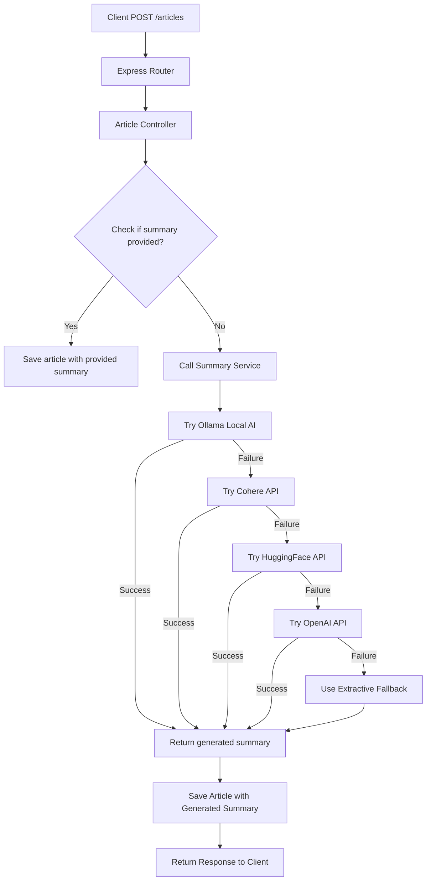

# Smart Content Aggregator API

A RESTful API for a content aggregation service with AI-powered features, built with TypeScript, Node.js, Express, and MongoDB.

##  Features

### Core Functionality
- **Article Management**: Create, retrieve, and manage articles
- **User Profiles**: User creation with interest tracking
- **Interaction Tracking**: Record user engagements (views, likes, shares, comments)
- **Pagination & Filtering**: Efficient data retrieval with search capabilities

### AI-Powered Features (Stretch Goal B Implemented)
- **Automatic Summary Generation**: Multiple AI providers with fallback system
- **Multi-Provider Support**: OpenAI, HuggingFace, Cohere, Ollama (local), and extractive fallback
- **Intelligent Provider Selection**: Automatic failover between AI services
- **Summary Regeneration**: On-demand summary updates for existing articles

##  Architecture

### System Flow

```
┌─────────────────┐    ┌───────────────────┐    ┌────────────────────┐
│   Client        │    │   Express.js      │    │   MongoDB          │
│   Application   │ ──▶│   API Server      │ ──▶│   Database         │
└─────────────────┘    └───────────────────┘    └────────────────────┘
         │                         │                         │
         │                         │                         │
         ▼                         ▼                         ▼
┌─────────────────┐    ┌───────────────────┐    ┌────────────────────┐
│   Frontend      │    │   Controllers     │    │   Models           │
│   UI            │    │   (Route handlers)│    │   (Data schemas)   │
└─────────────────┘    └───────────────────┘    └────────────────────┘
                                │                         │
                                │                         │
                                ▼                         ▼
                        ┌───────────────────┐    ┌────────────────────┐
                        │   Services        │ ◀──│   AI Integration   │
                        │   (Business logic)│    │   Layer            │
                        └───────────────────┘    └────────────────────┘
                                │                         │
                                │                         │
                                ▼                         ▼
                        ┌───────────────────┐    ┌────────────────────┐
                        │   Middleware      │    │   External AI      │
                        │   (Auth, Validation)│  │   Providers        │
                        └───────────────────┘    └────────────────────┘
```

### Data Flow for Article Creation with AI Summary



##  Technical Stack

- **Runtime**: Node.js
- **Language**: TypeScript
- **Framework**: Express.js
- **Database**: MongoDB with Mongoose ODM
- **AI/NLP**: Multiple providers with fallback system
- **Validation**: Joi for request validation
- **Documentation**: Swagger/OpenAPI 3.0
- **Security**: Helmet.js, CORS protection

##  Installation

1. **Clone the repository**
   ```bash
   git clone https://github.com/Adecom16/Smart-Content-Aggregator-API.git
   cd smart-content-aggregator
   ```

2. **Install dependencies**
   ```bash
   npm install
   ```

3. **Set up environment variables**
   ```bash
   cp .env.example .env
   ```
   Edit `.env` with your configuration:
   ```env
   PORT=3000
   MONGODB_URI=mongodb://localhost:27017/content-aggregator
   NODE_ENV=development
   
   # AI Provider API Keys 
   OPENAI_API_KEY=your_openai_key
   HUGGINGFACE_API_KEY=your_huggingface_key
   COHERE_API_KEY=your_cohere_key
   ```

4. **Set up MongoDB**
   - Install MongoDB locally or use MongoDB Atlas
   - Update `MONGODB_URI` in your `.env` file

5. **Set up Ollama (optional, for local AI)**
   ```bash
   # Install Ollama
   curl -fsSL https://ollama.ai/install.sh | sh
   
   # Pull a model
   ollama pull llama2
   ```

6. **Start the application**
   ```bash
   # Development mode with hot reload
   npm run dev
   
   # Production mode
   npm run build
   npm start
   ```

## API Endpoints

## Articles
- `POST /api/articles` - Create a new article (with auto-summary generation)
- `GET /api/articles` - Get paginated articles with filtering
- `GET /api/articles/:id` - Get specific article
- `PUT /api/articles/:id` - Update article
- `DELETE /api/articles/:id` - Delete article
- `POST /api/articles/:id/summary/regenerate` - Regenerate summary for article
- `GET /api/articles/stats` - Get article statistics
- `GET /api/articles/providers/status` - Get AI provider status
- `POST /api/articles/bulk/regenerate-summaries` - Bulk regenerate summaries
- `GET /api/articles/tags/:tags` - Get articles by tags

## Users
- `POST /api/users` - Create a new user
- `GET /api/users` - Get paginated users
- `GET /api/users/:id` - Get specific user
- `PUT /api/users/:id` - Update user interests
- `DELETE /api/users/:id` - Delete user

## Interactions
- `POST /api/interactions` - Record user interaction
- `DELETE /api/interactions/remove` - Remove interaction (unlike, unshare)
- `GET /api/interactions/user/:userId/article/:articleId` - Get user's interaction status for article
- `GET /api/interactions/user/:userId` - Get user's interactions
- `GET /api/interactions/article/:articleId` - Get article interactions
- `GET /api/interactions/article/:articleId/comments` - Get article comments
- `GET /api/interactions/article/:articleId/stats` - Get article interaction statistics
- `GET /api/interactions/article/:articleId/shares` - Get article share analytics
- `PUT /api/interactions/:id` - Update a comment
- `DELETE /api/interactions/:id` - Delete specific interaction

## Recommendations
- `GET /api/recommendations/user/:user_id` - Get personalized recommendations
- `GET /api/recommendations/trending` - Get trending articles
- `GET /api/recommendations/popular` - Get popular articles
- `GET /api/recommendations/user/:user_id/insights` - Get recommendation insights

## Documentation
- `GET /api-docs` - Interactive API documentation (Swagger UI)


##  AI Summary Generation

### Provider Priority (with automatic fallback)
1. **Ollama** (Free, local) - Requires Ollama installed locally
2. **Cohere** (Free tier available) - Requires API key
3. **HuggingFace** (Limited free models) - Requires API key
4. **OpenAI** (Paid, most reliable) - Requires API key
5. **Extractive Fallback** (Always available) - TF-IDF based summarization

### Configuration
The system automatically uses available providers based on configured API keys. No API keys are required for basic functionality thanks to the local Ollama and extractive fallback options.

##  Stretch Goal Implementation: Option B

### AI-Powered Summary Generation

I implemented **Option B: AI-Powered Summary Generation** with a comprehensive multi-provider approach:

### Technical Implementation

**Multi-Provider Architecture:**
- **Extractive Summarizer**: TF-IDF based algorithm as ultimate fallback
- **Ollama Integration**: Free local AI using open-source models
- **Cohere API**: Free tier integration with rate limiting
- **HuggingFace**: Free model integration with proper error handling
- **OpenAI**: Premium option for highest quality summaries

**Smart Provider Selection:**
```typescript
// The system tries providers in order of cost-effectiveness
const providers = [
  { name: 'ollama', method: () => this.generateOllamaSummary(content, config) },
  { name: 'cohere', method: () => this.generateCohereSummary(content, config) },
  { name: 'huggingface', method: () => this.generateHuggingFaceSummary(content, config) },
  { name: 'openai', method: () => this.generateOpenAISummary(content, config) }
];
```

**Key Features:**
- Automatic failover between providers
- Configurable summary length and quality
- Batch processing for multiple articles
- Provider health monitoring and status reporting

## Database Schema

### Article Model
```typescript
{
  title: String,        // Article title
  content: String,      // Full article content
  author: String,       // Author name
  summary: String,      // Generated summary
  tags: [String],       // Categorization tags
  createdAt: Date,      // Creation timestamp
  updatedAt: Date       // Last update timestamp
}
```

### User Model
```typescript
{
  username: String,     // Unique username
  interests: [String],  // User preferences for recommendations
  createdAt: Date,      // Creation timestamp
  updatedAt: Date       // Last update timestamp
}
```

### Interaction Model
```typescript
{
  userId: ObjectId,     // Reference to User
  articleId: ObjectId,  // Reference to Article
  interactionType: String, // 'view', 'like', 'share', 'comment'
  content: String,      // For comments
  shareMetadata: {      // For share interactions
    platform: String,
    message: String
  },
  createdAt: Date       // Interaction timestamp
}
```

## Testing the API

### Using the API Documentation
1. Start the server
2. Navigate to `http://localhost:3000/api-docs`
3. Use the interactive Swagger UI to test endpoints

### Sample Requests

**Create an Article with Auto-Summary:**
```bash
curl -X POST http://localhost:3000/api/articles \
  -H "Content-Type: application/json" \
  -d '{
    "title": "Introduction to Artificial Intelligence",
    "content": "Artificial intelligence is transforming how we work and live...",
    "author": "Tech Writer",
    "tags": ["ai", "technology", "future"]
  }'
```

**Create a User:**
```bash
curl -X POST http://localhost:3000/api/users \
  -H "Content-Type: application/json" \
  -d '{
    "username": "techlover",
    "interests": ["technology", "ai", "machine learning"]
  }'
```

**Record an Interaction:**
```bash
curl -X POST http://localhost:3000/api/interactions \
  -H "Content-Type: application/json" \
  -d '{
    "user_id": "USER_ID",
    "article_id": "ARTICLE_ID", 
    "interaction_type": "like"
  }'
```

## Future Enhancements

If I had more time, I would implement:

### Immediate Improvements
1. **Authentication & Authorization**: JWT-based auth system
2. **Comprehensive Testing**: Unit, integration, and end-to-end tests
3. **Rate Limiting**: Protect against abuse and DDoS attacks
4. **Caching Layer**: Redis for frequently accessed data
5. **Input Sanitization**: Enhanced security against injection attacks

### Advanced Features
1. **Real-time Recommendations**: WebSocket connections for live updates
2. **Advanced Analytics**: User behavior tracking and insights
3. **Content Moderation**: AI-based content filtering
4. **Personalization Engine**: Machine learning for improved recommendations
5. **Export Functionality**: Data export for users

### Deployment Ready
1. **Dockerization**: Containerization for easy deployment
2. **CI/CD Pipeline**: Automated testing and deployment
3. **Monitoring**: Application performance monitoring
4. **Logging**: Structured logging with rotation
5. **Health Checks**: Comprehensive system health monitoring

## Technical Choices

### Why Express.js with TypeScript?
- **Type Safety**: TypeScript provides compile-time error checking
- **Ecosystem**: Rich middleware and library support
- **Performance**: Lightweight and fast for API services
- **Flexibility**: Unopinionated structure allows for custom architecture

### Why MongoDB?
- **Schema Flexibility**: Easy to evolve data models as requirements change
- **JSON-like Documents**: Natural fit for JavaScript/TypeScript applications
- **Scalability**: Horizontal scaling capabilities
- **Aggregation Framework**: Powerful analytics and data processing

### Why Multiple AI Providers?
- **Redundancy**: No single point of failure for summary generation
- **Cost Optimization**: Free options available for development and testing
- **Flexibility**: Users can choose based on quality/cost preferences
- **Future-proof**: Easy to add new providers as AI technology evolves


## 📄 License

This project is created for assessment purposes.